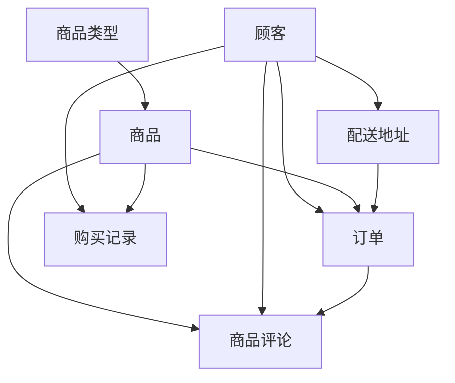

# 需求

本次数据库时间，我们小组以京东购物网页的后台数据库作为数据库设计的参考。

实现了包括商品实体、商品类型、订单、用户实体、配送地址、商品售后、商品评价等多个表，并根据实际应用中的需求，创建了一些触发器，约束等数据库应用组件，并尝试了基于python tkinter的前端节点用于展示，成功地完成了一个简易的数据购物平台 


## table

### 商品类型：type_product

#### 属性：

- 类型编号：type_id
- 类型名称：type_name

#### 约束：

- 主键：type_id

  

### 商品: product

#### 属性：

- 商品编号：product_id
- 商品名称：product_name
- 商品类型：type_id
- 价格：price
- 销量：sales
- 上架时间：launch_time
- 下架时间：off_time
- 商品描述：details
- 商店名称：shop_name

#### 约束：

- 主键：商品编号product_id
- 商品名不能为空
- 必须在table type_product存在该type_id


### 用户:consumer

#### 属性：

- 用户账号：user_id
- 用户密码：passwd
- 用户名：username
- 昵称：nickname
- 手机号：tel_num
- 性别：gender
- 生日：birth_date
- 上次登录时间：last_login 

#### 约束：

- 主键：用户账号user_id

- 性别只能为'M' 或 'F'
- 密码不能为空
- 用户名不能为空
- 电话号不能为空


### 配送地址:address

#### 属性：

- 地址编号：addr_id
- 接收者：receiver
- 详细地点：address_detail
- 地区名：region
- 国家：country
- 省份：province
- 城市：city

#### 约束：

- 主键：地址编号addr_id
- 必须在table consumer的user_id存在该receiver


### 订单: orders

#### 属性：

- 订单号：order_no
- 下单时间：order_time
- 用户编号：user_id
- 商品编号：product_id
- 订单状态：status
- 订单地址编号：addr_id

#### 约束：

- 主键：订单号order_no
- 必须在table consumer的user_id存在本table中的user_id
- 必须在table product的product_id存在本table中的product_id
- 必须在table address的addr_id存在本table中的addr_id

 

### 商品评价: product_comments 

#### 属性：

- 用户编号：user_id 
- 评论内容：contents
- 会员级别：user_level 
- 点赞数：likes_num 
- 回复数：reply_num
- 评价星级：star
- 评论时间：comment_time

####  约束：

- 必须在table product_comments 的user_id存在本table中的user_id

 

### 购买记录: purchase

#### 属性：

- 用户编号：user_id 
- 商品编号：product_id   

#### 约束：

- 必须在table consumer的user_id存在本table中的user_id
- 必须在table product的product_id存在本table中的product_id


### 建表顺序：



# E-R 图及完整的scheme定义（触发器，存储过程等）


# 代码

```sql
drop table if exists type_product, product,consumer,address,orders,product_comments,purchase;
drop  SEQUENCE if exists orders_id_seq;

-- 创建商品类型表
CREATE TABLE IF NOT EXISTS  type_product(
	 type_id  BIGINT,
	 type_name  VARCHAR(100),
	PRIMARY KEY ( type_id )
);

-- 创建商品表
CREATE TABLE IF NOT EXISTS  product(
	 product_id  BIGINT ,
	 product_name  VARCHAR(100) NOT NULL,
	 type_id  int,
	 price  int,
	 sales  int,
	 launch_time  DATE,
	 out_time  DATE,
	 details  varchar(100),
	 shop_name  varchar(100),
     PRIMARY KEY (product_id ),
  	CONSTRAINT fk_pro_type FOREIGN KEY(type_id) REFERENCES type_product(type_id)
);

-- 创建顾客表
CREATE TABLE IF NOT EXISTS  consumer (
	 user_id  BIGINT,
	 passwd varchar(12) NOT NULL, 
	 username  VARCHAR(100) NOT NULL,
	 nickname  VARCHAR(100) NOT NULL,
	 tel_num  VARCHAR(11) NOT NULL,
	 gender  CHAR(1),
	 birth_date  DATE,
	 last_login  DATE,
	PRIMARY KEY ( user_id ),
	CONSTRAINT user_sex CHECK (
		 gender  = 'M' OR  gender  = 'F'
	)
) ;

-- 创建地址表
CREATE TABLE IF NOT EXISTS address (
     addr_id            BIGINT  PRIMARY KEY,
     receiver           INT REFERENCES consumer(user_id),
     address_detail     VARCHAR(100),
     region             VARCHAR(20),
     country            VARCHAR(20),
     province           VARCHAR(20),
     city               VARCHAR(20)
) ;

-- 创建订单表
CREATE TABLE IF NOT EXISTS  orders (
     order_no           serial,
     order_time         DATE,
     user_id            INT REFERENCES consumer(user_id),
     product_id         INT REFERENCES product(product_id),
     status             VARCHAR(10),
     addr_id            INT REFERENCES address(addr_id),
     total_price        DECIMAL(7,2),
	 PRIMARY KEY(order_no)
) ;

-- --增加自增序列
-- CREATE SEQUENCE orders_id_seq 
--     INCREMENT 1 
--     START 1 
--     NO MINVALUE 
--     NO MAXVALUE 
--     CACHE 2;
-- --增加键id
-- alter table orders add column order_no int;
-- --修改键id为自增序列
-- alter table orders alter column order_no set default nextval('orders_id_seq');


-- 创建商品评论表
CREATE TABLE IF NOT EXISTS product_comments (
     release_user       BIGINT  REFERENCES consumer(user_id),
     contents           VARCHAR(100),
     user_level         INT,
     like_num           INT,
     reply_num          INT,
     star               INT,
     comment_date       DATE
) ;

-- 创建购买记录表
CREATE TABLE IF NOT EXISTS purchase (
     user_id       BIGINT  REFERENCES consumer(user_id),
     product_id    BIGINT REFERENCES  product(product_id)
) ;

-- 添加商品类型
insert into type_product (type_id, type_name) VALUES (1,'电子设备');
insert into type_product (type_id, type_name) VALUES (2,'电子设备');
insert into type_product (type_id, type_name) VALUES (3,'日用百货');


-- 添加商品数据
insert into product (product_id, product_name, type_id, price, sales, launch_time, out_time,details, shop_name) VALUES (01,'iPhone 12', 1, 5000,500,'2021-10-30','2031-10-30','一部手机','苹果手机店');
insert into product (product_id, product_name, type_id, price, sales, launch_time, out_time,details, shop_name) VALUES (02,'OPPO reno 6', 1, 6000,600,'2021-05-30','2031-06-30','一部手机','OPPO手机店');
insert into product (product_id, product_name, type_id, price, sales, launch_time, out_time,details, shop_name) VALUES (03,'蓝月亮洗衣液', 1, 30,60000,'2005-05-30','2041-06-30','洗衣液','蓝月亮官网');

-- 创建顾客数据
insert into consumer (user_id, passwd, username, nickname, tel_num, gender, birth_date, last_login) VALUES (001,'why','why','giao','15222168550','M','2004-05-30','2021-09-30');
insert into consumer (user_id, passwd, username, nickname, tel_num, gender, birth_date, last_login) VALUES (002,'changqingaas','changqingaas','JiaRan','110','F','2010-05-30','2021-09-30');

-- 添加地址数据 
insert into address (addr_id, receiver, address_detail, region, country, province, city) VALUES (0001, 001, '海河路250号', '津南区', '中国','天津市','天津市');
 
 
-- 添加订单数据
insert into orders (order_time, user_id, product_id, status, addr_id, total_price) VALUES ('2021-09-18',001,01,'状态：未送达',0001,5000);
insert into orders (order_time, user_id, product_id, status, addr_id, total_price) VALUES ('2000-09-18',001,02,'状态：未送达',0001,6000);


-- 创建商品评论数据
insert into product_comments (release_user, contents, user_level, like_num, reply_num, star, comment_date) VALUES (001,'good',87,77,2,5,'2021-09-08');


-- 创建购买记录 
insert into purchase(user_id, product_id) VALUES (001,01);
insert into purchase(user_id, product_id) VALUES (001,02);

```

